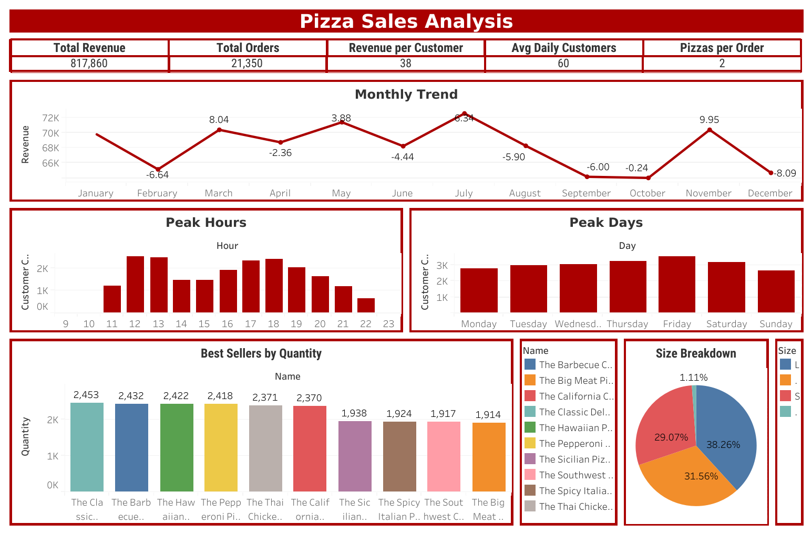

#  Pizza Sales Analysis (SQL + Tableau)

## Project Overview

This project demonstrates an end-to-end data analysis workflow using SQL and Tableau on a pizza sales dataset.

The project includes:
- Data cleaning and validation using SQL  
- Exploratory data analysis (EDA)  
- Business insight generation  
- Interactive dashboard creation in Tableau  

## Business Questions

This analysis aims to answer the following:

- How many customers visit the store daily?  
- Are there peak hours or days for sales?  
- What are the monthly sales trends?  
- Which pizzas are the best sellers?  
- How can the business increase revenue?  

## Dashboard

## Data Cleaning & Preparation

- Created working copies of raw tables  
- Removed duplicate records across all tables  
- Standardized date and time formats  
- Validated relationships between tables (foreign key checks)  
- Handled null and missing values  
- Removed irrelevant columns  

## Data Analysis

- Designed SQL queries to answer key business questions  
- Used:
  - Joins to combine multiple tables  
  - Aggregations for KPI calculations  
  - Subqueries for intermediate analysis  
  - CTEs and window functions (`LAG`) for trend analysis  

## Data Visualization

- Imported cleaned data into Tableau  
- Built individual visualizations for each metric  
- Combined charts into a single dashboard  
- Applied consistent formatting and theme 

## Key Insights

- 👥 Average of **60 customers per day**  
- ⏰ Peak hours:
  - Lunch: **12:00 – 13:00**
  - Dinner: **18:00 – 19:00**  
- 📅 Peak day: **Friday**  
- 📉 Lowest activity: **Sunday**  
- 🍕 Best-selling pizza: **BBQ Chicken Pizza**  
- 📦 Large pizzas account for **38% of total sales**  
- 📉 Sales decline observed in:
  - September  
  - October  
  - December 

## Business Recommendations

- Introduce **lunch and dinner promotions** during peak hours  
- Offer **Sunday or weekend deals** to boost low-performing days  
- Run **seasonal campaigns**:
  - Back-to-school promotions (September)  
  - Halloween promotions (October)  
  - Holiday promotions (December)  
- Implement a **customer loyalty program** to increase repeat purchases 

## Tools

- SQL (MySQL)
- Tableau
